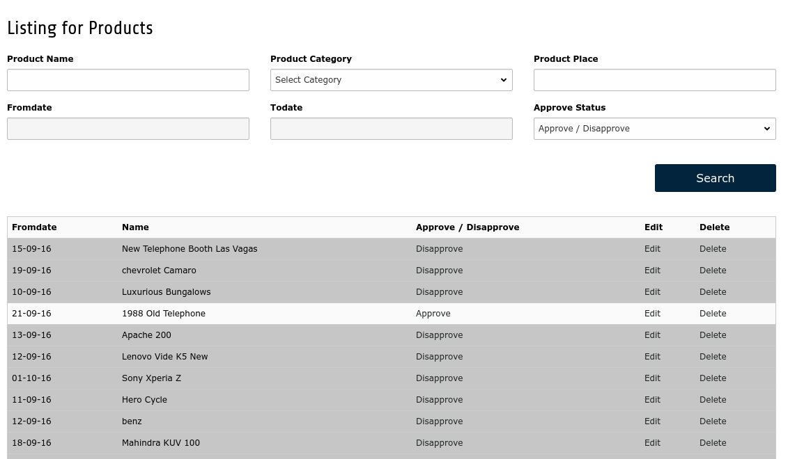
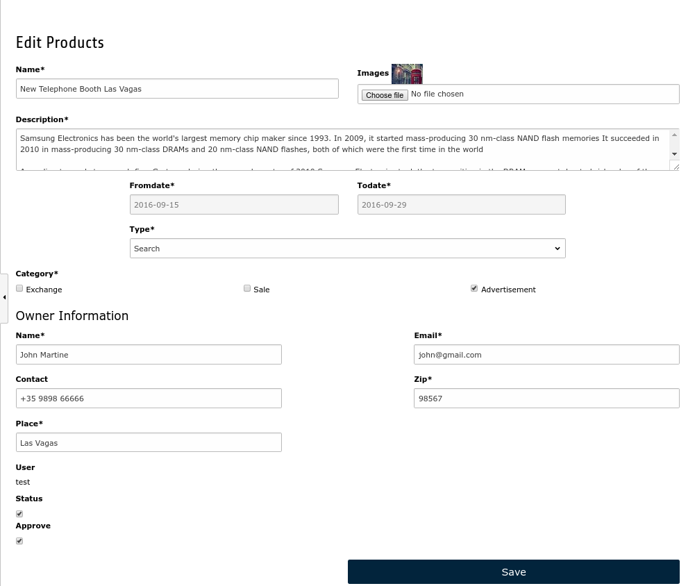
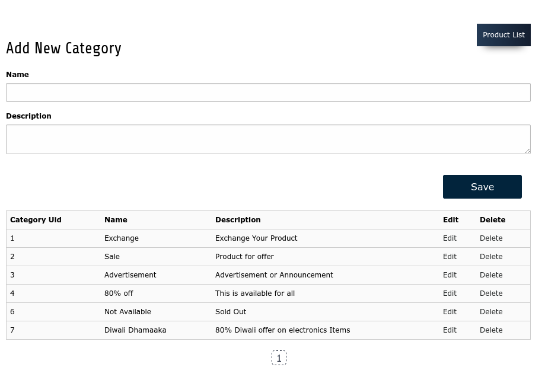

.. include:: ../Includes.txt

.. _backend:

Backend Module
===============
To manage product advertisement there is a backend module **“Manage Products”**.

Manage Products
----------------
In manage products, there is also **‘Advance Search’** option.

Admin can easily Approve / Disapprove advertisement by click on links below the **'Approve/Disapprove'** column. **'Approved'** advertisements have a value named **'Disapprove'** and **'Disapproved'** advertisements have a value named **'Approve'** in that particular column.

There is also a link available for delete advertisement.

Edit Advertisements
--------------------
In manage products, there is a link for **'EDIT'**. There will be a form to edit advertisement where admin can modify detail of advertisement from the backend.

Manage Category
----------------
This backend module is for manage categories where Admin can add / edit and remove categories for advertisement.

