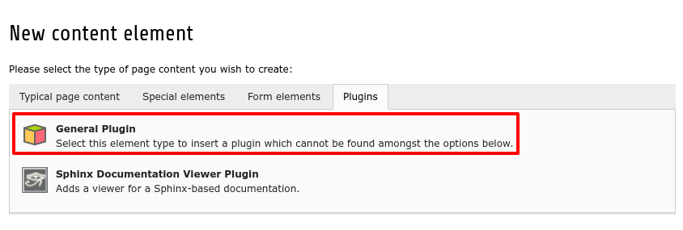
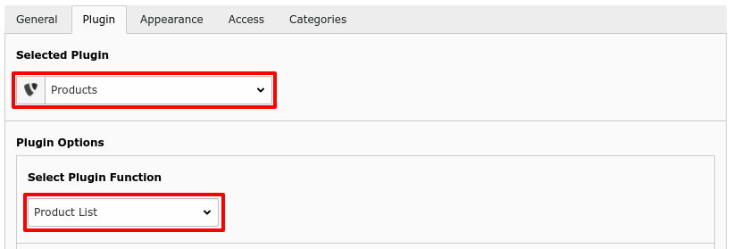
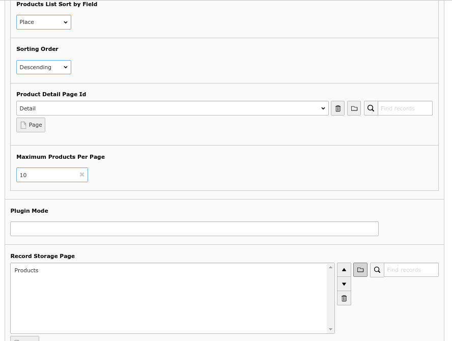

.. include:: ../Includes.txt

.. _enxtensionsetup:

.. warning:: To use create, edit, myproduct functionality from frontend, then a frontend user must be login.

Extension Setup
===============

This chapter contains information for setup extension, from this chapter you will get information on basic setup requirements for the extension.

.. note:: Create separate pages for each plugin.

Add first plugin Product List
^^^^^^^^^^^^^^^^^^^^^^^^^^^^^^
First create storage folder for Product Advertisement, Now open Page Menu and click on **'Content'**. Go to **'Plugins'** tab and select **'General Plugin'**.
Now go to **'Plguin'** and Select **'Products'** from Select Plugins Dropdown. then after select **'Product List'** from Select Plugin Function dropdown.

Product List plugin inner configuration
^^^^^^^^^^^^^^^^^^^^^^^^^^^^^^^^^^^^^^^^

There are some configurations for product list plugin **'soring by field'**, **'sorting order'**, **'maximum products per page'**, to set sorting and pagination configuration.
set **'Product Detail page id'** to display detail of product advertisement and set Storage Folder Id to **'Record Storage Page'**.

