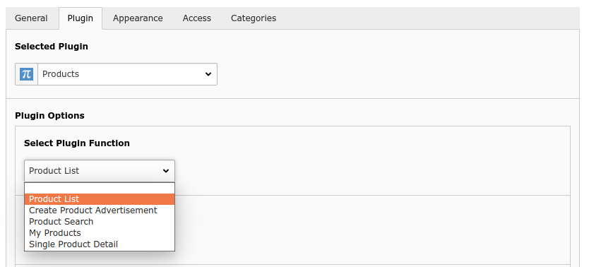
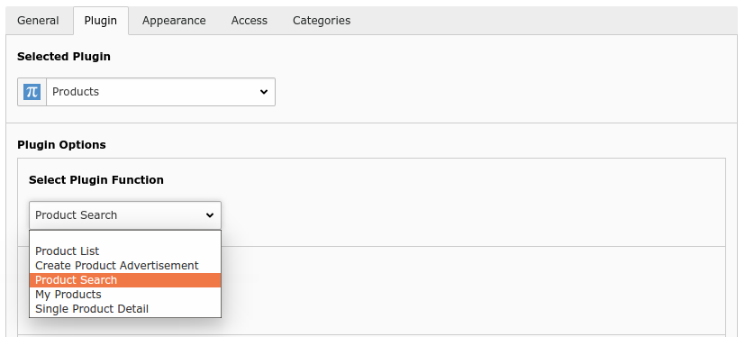
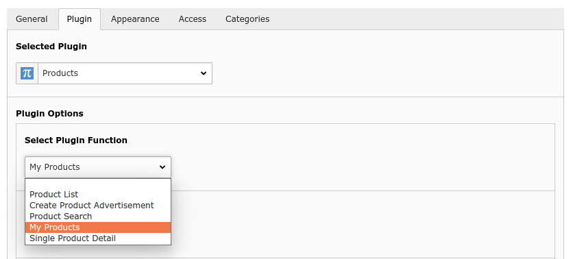
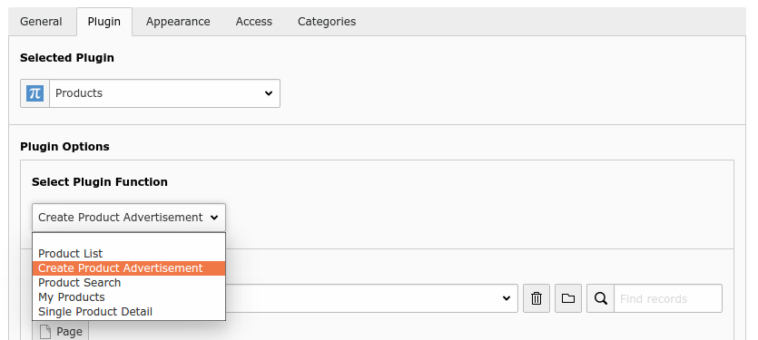
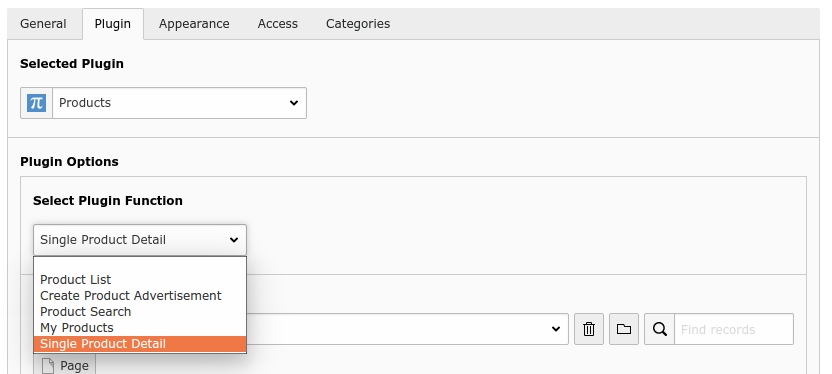

.. include:: ../Includes.txt

.. _frontend:

Frontend Plugin
================

Product List
-------------
This plugin is use for generate list of products advertisements. It provide different sorting functionality like sort via field(name, date, place), pagination and max product per page.

Product Search
--------------
This plugin is for the Advance search functionality which provide search product advertisements via category, name and place.

My Products
------------
This plugin display user wise list of products,  where user can hide/show and edit their products. If user wants to see their products then user must login otherwise this page redirect to home page

Create Product Advertisement
-----------------------------
This plugin allow front end user to create and edit their products. To use this plugin user must login otherwise page redirect to homepage.

Single Product Detail
----------------------
This plugin displays complete detail of product, It contain Image of product, product description, category and owner details.

Send Message
------------
This functionality is integrated in single product detail plugin from this Buyer can directly send inquiry message to user via email.

Get Print
----------
This functionality is also integrated in single product detail plugin from this buyer can print out product details.
