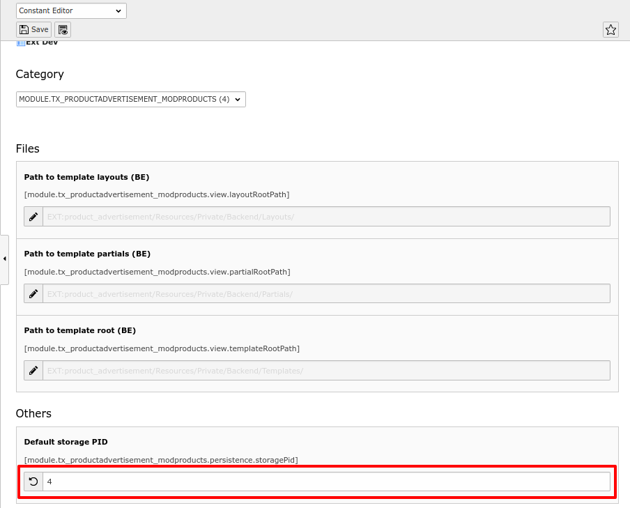
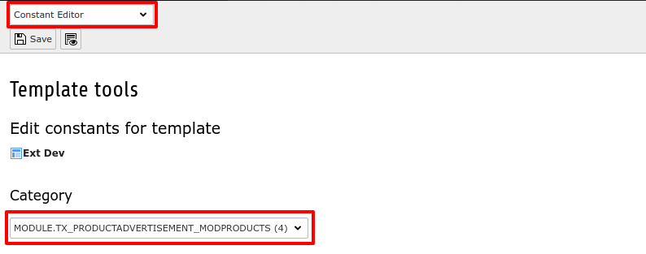
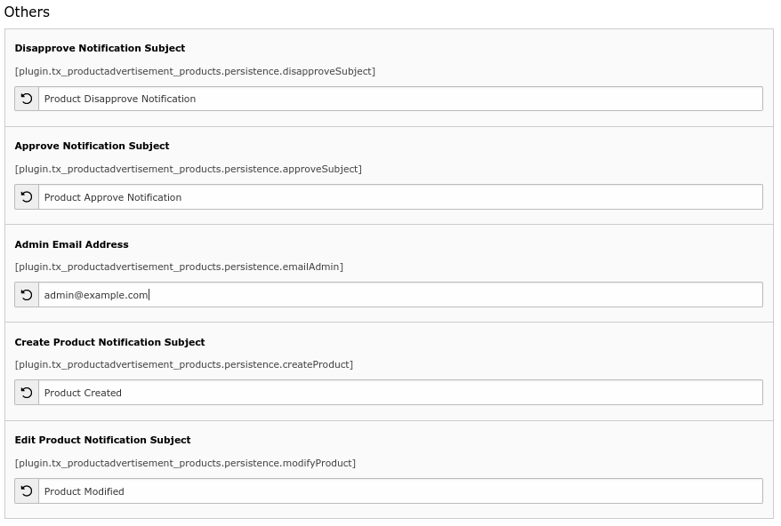
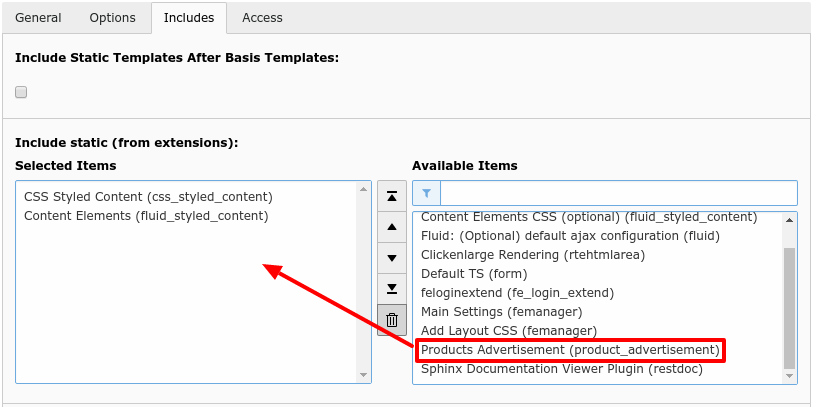

.. include:: ../Includes.txt

.. _installation:

Installation
=============
Install extension from extension manager. There are some TypoScript configurations those are listed below and give short information about it.

.. warning::  Please configure your mail settings from INSTALL tool before use this extension.

TypoScript Setup
-----------------

:storagePid: Set Storage Page id for backend module.

Steps to set storage page id have been shown in figure

Email Notification Configuration
---------------------------------

+-----------------------+---------------------------------------------------------------------------------+
| **emailAdmin**        | Set email address of admin.                                                     |
+-----------------------+---------------------------------------------------------------------------------+
+-----------------------+---------------------------------------------------------------------------------+
| **disapproveSubject** | Set subject of email notification when the product advertisement is disapproved.|
+-----------------------+---------------------------------------------------------------------------------+
+-----------------------+---------------------------------------------------------------------------------+
| **approveSubject**    | Set subject of email notification when the product advertisement is Approved.   |
+-----------------------+---------------------------------------------------------------------------------+
+-----------------------+---------------------------------------------------------------------------------+
| **createProduct**     | Set subject of email notification when the product advertisement is created.    |
+-----------------------+---------------------------------------------------------------------------------+
+-----------------------+---------------------------------------------------------------------------------+
| **modifyProduct**     | Set subject of email notification when the product advertisement is modified.   |
+-----------------------+---------------------------------------------------------------------------------+

Steps to set email configuration have been shown in figure

Add static template of extension
^^^^^^^^^^^^^^^^^^^^^^^^^^^^^^^^^
To add static template go to TypoScript Template menu and click on **'Edit Whole Template Record'**, It show you the page template configurations, then after click on **Include** tab, In include tab there are two blocks available **'Available Items'** and **'Selected Items'**.

From **'Available Items'** find out **'product_advertisement(product_advertisement)'** template and add it to the template.

the example has been shown in the below figure.

